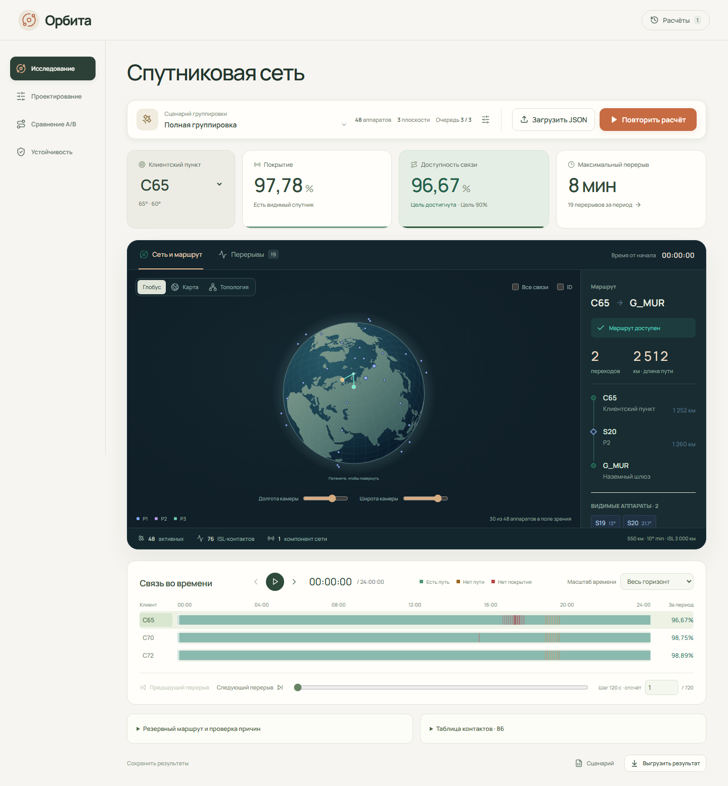

# Орбита

Веб-приложение для исследования спутниковой сети по модели КосмоХакатона 2026. Реализованы контракт данных, независимое расчётное ядро и рабочий веб-контур: загрузка JSON → фоновый расчёт → карта/топология → маршруты и перерывы → экспорт.

Версия 0.5.0 включает этапы 0–5: редактор всех групп параметров и отказов, ревизии с родителем, сравнение A/B с общим временем и камерой, глобус/карта/топология, N−1 и рекомендации с полным пересчётом. Внешняя публикация остаётся задачей выпуска. [Статус и следующие этапы](docs/ROADMAP.md).

Рабочий цикл: рассчитать базу → «Проектирование» → сохранить и применить ревизию → рассчитать вариант → «Сравнение A/B». В «Устойчивости» проверяются одиночные отказы и варианты улучшения. [Руководство по новым режимам](docs/DESIGN_AND_RESILIENCE.md).

**Впервые в проекте?** Начните с [«Как работает Орбита — объяснение с нуля»](docs/HOW_IT_WORKS.md): от положения спутника и условий связи до маршрутов, процентов доступности, перерывов и проверяемых рекомендаций.



## Быстрый запуск через Docker

Нужен работающий Docker Engine с Compose. Из корня проекта:

```powershell
docker compose up --build -d
```

Открыть http://localhost:8000. Проверка: http://localhost:8000/api/health. Остановка: `docker compose down`. Результаты сохраняются в именованном томе; команда `down -v` удаляет их. Для другого порта задать `ORBITA_PORT`, например `$env:ORBITA_PORT='18000'` в PowerShell.

Карты и шрифты включены в сборку. После установки образа приложение не зависит от внешних CDN. Первый расчёт запускается кнопкой «Рассчитать»; исходные файлы не изменяются.

## Локальная разработка

Python 3.12 и Node.js 22.12+ (проверено также на Node 24). Команды PowerShell из корня:

```powershell
python -m venv .venv
.\.venv\Scripts\python.exe -m pip install -r requirements-dev.txt
cd web
npm ci
npm run build
cd ..
.\.venv\Scripts\python.exe -m uvicorn orbita.api:app --host 127.0.0.1 --port 8000
```

Открыть http://127.0.0.1:8000. Для горячего обновления UI вместо сборки запустить `npm run dev` в отдельном терминале в `web`; адрес http://127.0.0.1:5173, запросы `/api` перенаправляются на порт 8000. На Linux Python виртуального окружения: `.venv/bin/python`.

CLI не требует веб-сервера:

```powershell
.\.venv\Scripts\python.exe -m orbita.cli "Данные/01_full_constellation.json" --output var/full-result.json
```

## Проверка

```powershell
.\.venv\Scripts\python.exe -m pytest -q
.\.venv\Scripts\python.exe -m ruff check orbita tests
cd web
npm run build
npx playwright install chromium
npm run test:e2e
```

Для E2E команда `python` должна указывать на окружение с установленными `requirements-dev.txt`: активировать `.venv` до запуска npm. Тесты сами запускают отдельный сервер на 8011 и используют `var/e2e`. Порт должен быть свободен. [Методика и результаты проверки](docs/VALIDATION.md).

## Устройство проекта

| Каталог | Назначение |
|---|---|
| `Данные`, `Расчетный модуль`, PDF в корне | Неизменённые материалы организаторов |
| `orbita` | Валидация, эталонная геометрия, графы, маршруты, метрики, CLI, API и задания |
| `web/src` | React/TypeScript: карта, топология, timeline, инспектор и история |
| `tests` | Контрактные, математические, графовые и интеграционные проверки |
| `research` | Исследование материалов, эксперименты и исходное проектное предложение |
| `docs` | Контракт, архитектура, статус, проверка и эксплуатация |
| `var` | Локальная база и артефакты; не исходный код |

[Математический контракт](docs/MODEL_CONTRACT.md) · [Архитектура](docs/ARCHITECTURE.md) · [Развёртывание](docs/DEPLOYMENT.md) · [Исходный анализ](research/proposal.md).

Сеанс браузера определяет доступ к истории: это изолированные анонимные рабочие области, а не система учётных записей. Очистка cookie лишает браузер доступа к старой истории. Для переноса нужно заранее экспортировать сценарий и результат.
