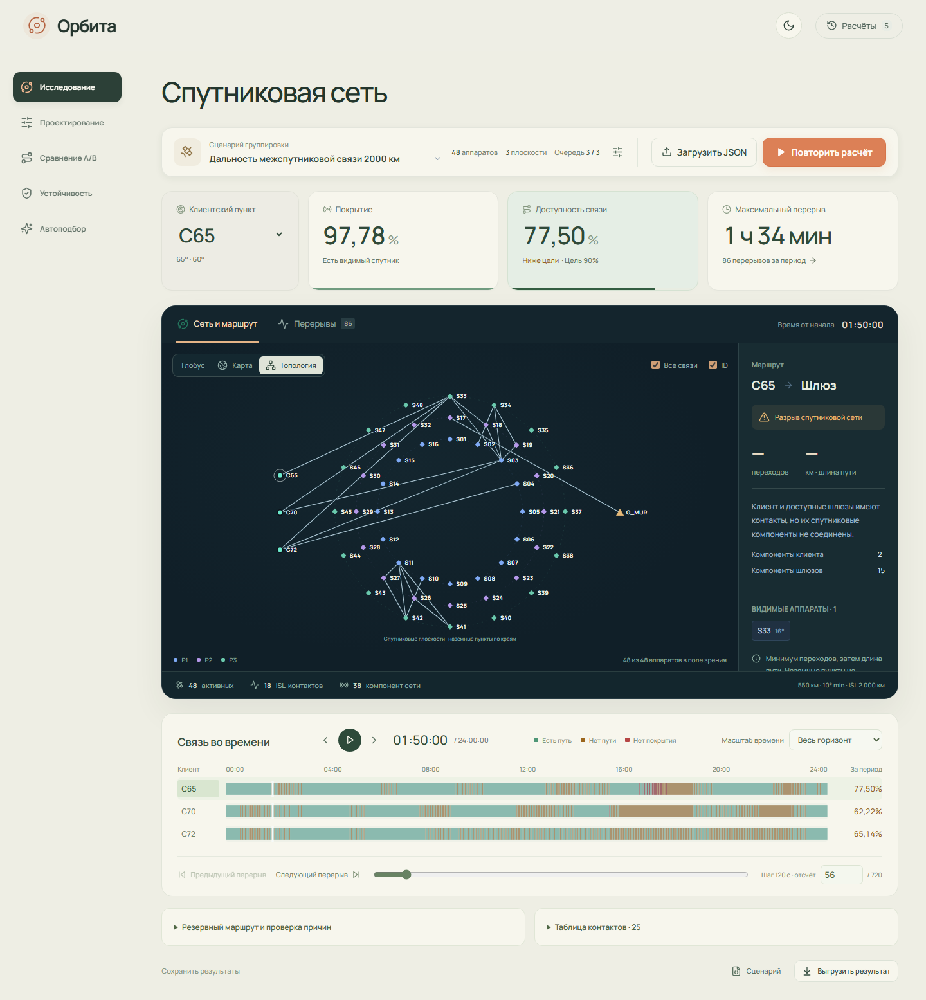
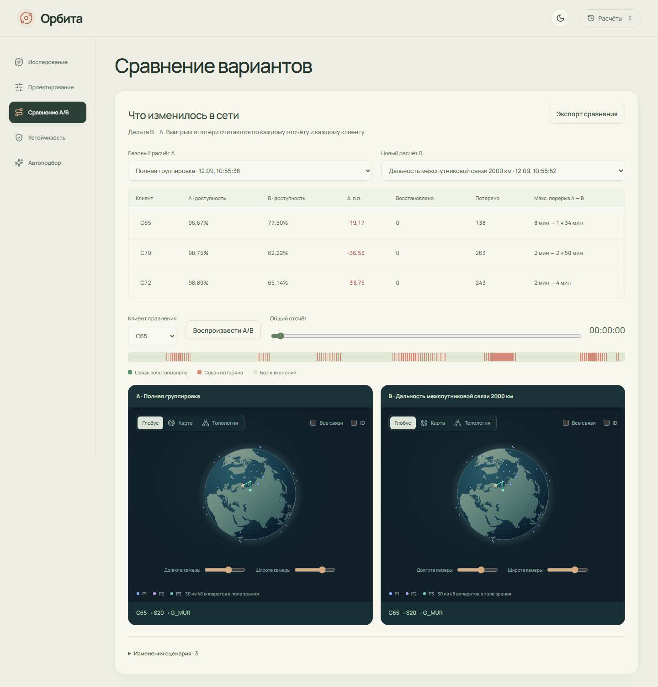
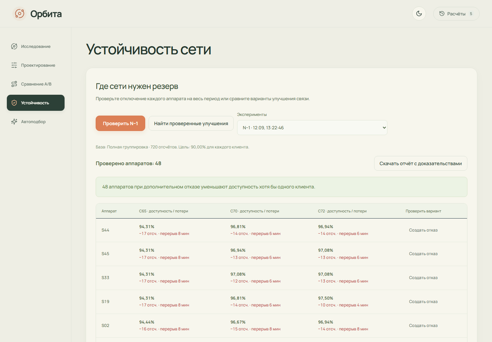
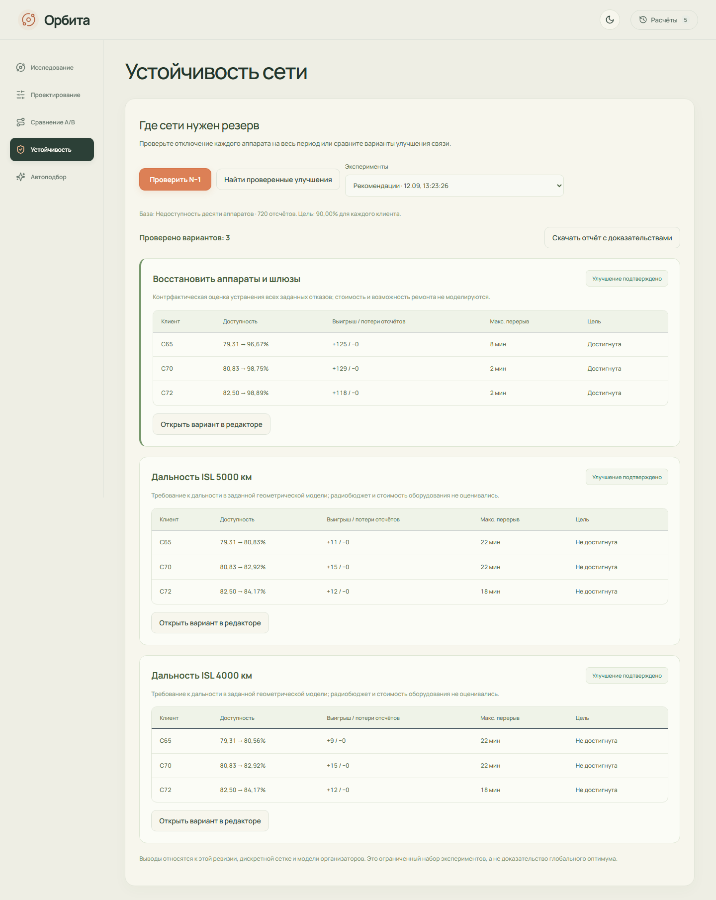
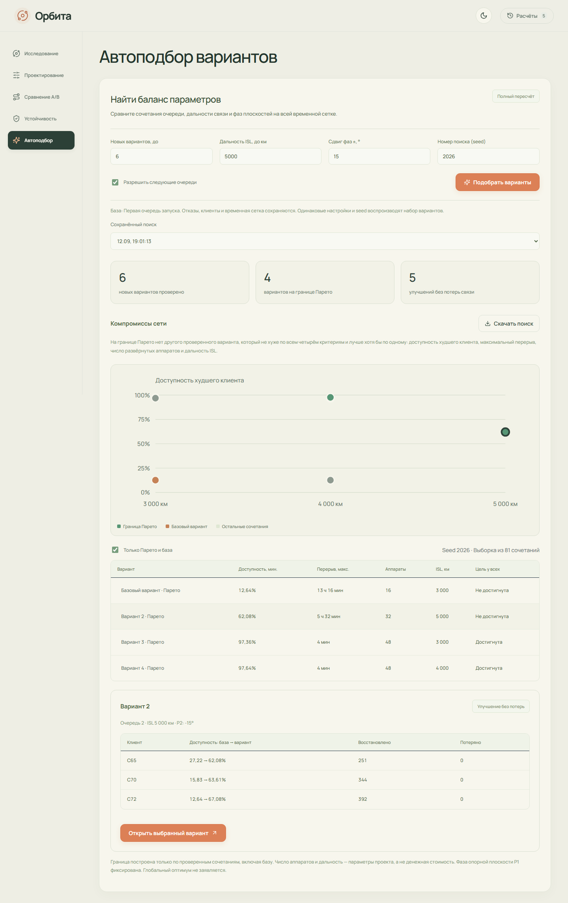
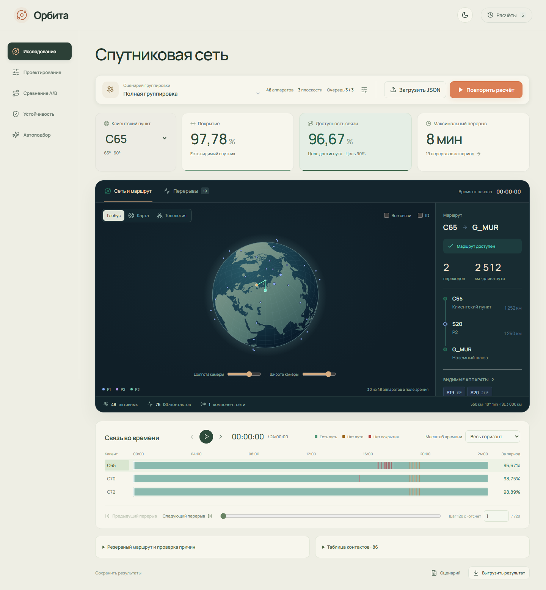
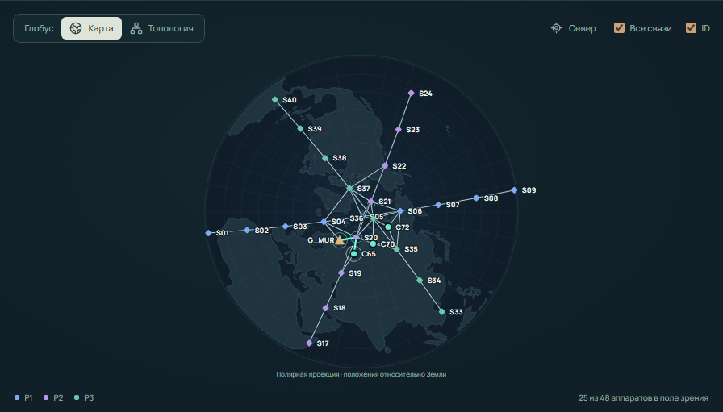
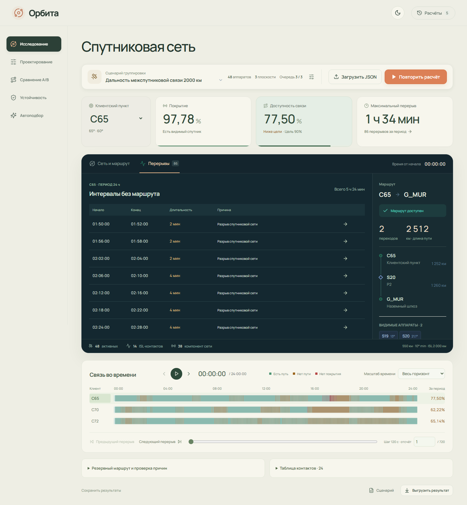
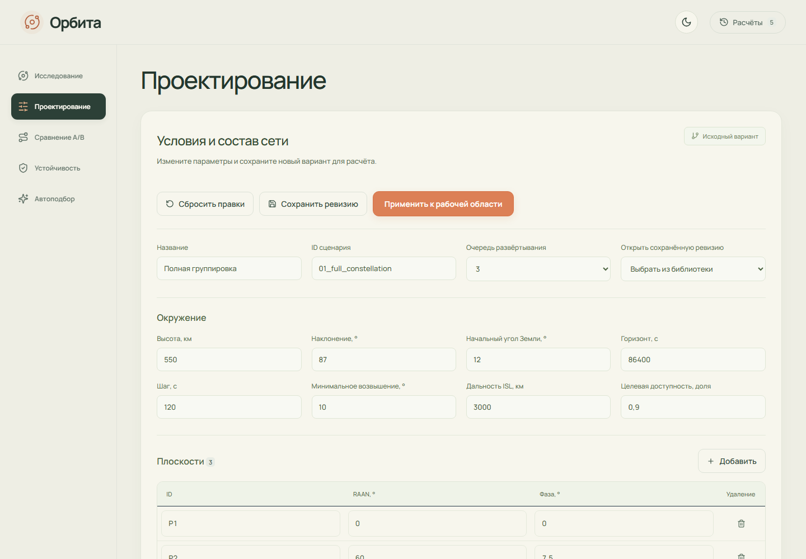
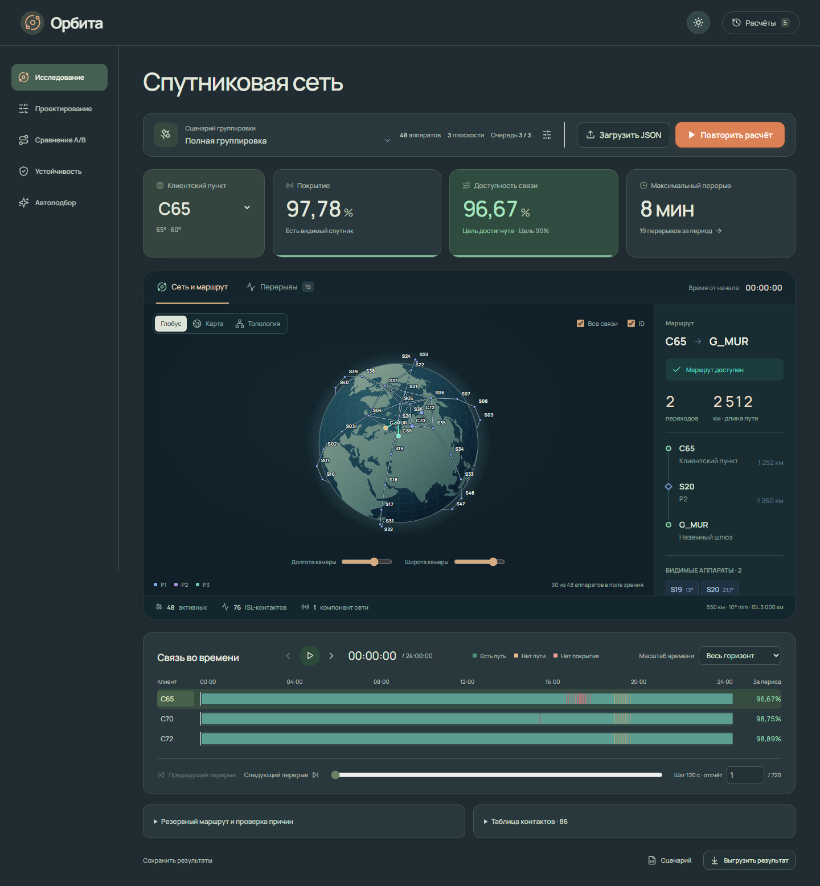

# Орбита

Документ описывает реализованную версию 0.6.0. Здесь приведены правила расчёта, устройство кода, работа в интерфейсе, форматы результатов, API, установка и эксплуатация. Возможности, которых пока нет, перечислены отдельно.

## Быстрый запуск

Из корня проекта при работающем Docker Engine с Compose:

```sh
docker compose -p orbita up -d --build
```

Открыть http://127.0.0.1:8000. Проверка сервиса: http://127.0.0.1:8000/api/health. Выбрать сценарий и нажать «Рассчитать».

Остановка с сохранением результатов: `docker compose -p orbita down`. Первая сборка требует интернета для установки зависимостей. Подробные команды для Windows, Linux и публичного HTTPS-сервера приведены в разделе 12.

## Содержание

1. [Назначение и границы модели](#1-назначение-и-границы-модели)
2. [Архитектура и движение данных](#2-архитектура-и-движение-данных)
3. [Входной сценарий и валидация](#3-входной-сценарий-и-валидация)
4. [Геометрия и контакты](#4-геометрия-и-контакты)
5. [Граф, маршруты и причины перерывов](#5-граф-маршруты-и-причины-перерывов)
6. [Временная сетка и показатели](#6-временная-сетка-и-показатели)
7. [Сравнение, устойчивость и автоподбор](#7-сравнение-устойчивость-и-автоподбор)
8. [Интерфейс и типовой рабочий процесс](#8-интерфейс-и-типовой-рабочий-процесс)
9. [Результаты и воспроизводимость](#9-результаты-и-воспроизводимость)
10. [Хранение, задания и сеансы](#10-хранение-задания-и-сеансы)
11. [API и CLI](#11-api-и-cli)
12. [Запуск и развёртывание](#12-запуск-и-развёртывание)
13. [Проверки, обслуживание и ограничения](#13-проверки-обслуживание-и-ограничения)

Это основная документация репозитория: от входного JSON и математической модели до интерфейса, проверки и развёртывания.

## 1. Назначение и границы модели

Приложение определяет, существует ли в каждый момент расчётной сетки путь от наземного клиента до работающего наземного шлюза через спутниковую сеть. Оно позволяет менять проект, задавать отказы, сравнивать результаты и искать сочетания параметров.

Клиенту недостаточно видеть спутник. Этот спутник должен видеть шлюз или иметь цепочку межспутниковых контактов до аппарата, который видит шлюз. Поэтому покрытие и сквозная доступность считаются раздельно.

Основные понятия:

| Термин | Значение |
|---|---|
| Сценарий | JSON с параметрами среды, составом сети, наземными пунктами и событиями |
| Клиент | Наземный источник, которому нужен путь до шлюза |
| Шлюз, gateway | Наземная конечная точка маршрута |
| Контакт | Геометрически допустимое двустороннее соединение |
| ISL | Контакт между двумя спутниками |
| Отсчёт | Один момент на временной сетке |
| Snapshot | Координаты, контакты и состояние сети в одном отсчёте |
| Ревизия | Сохранённая версия полного сценария |
| Расчёт, run | Задание и результат обработки конкретного сценария |
| Эксперимент | Пакет проверок относительно завершённого расчёта |
| Seed | Число, задающее воспроизводимый выбор сочетаний в автоподборе |

Приоритет имеют три PDF организаторов и исходный `Расчетный модуль/geometry.py`. В проекте используются сферическая Земля, круговые орбиты и заданные геометрические ограничения. Радиобюджет, атмосфера, помехи, загрузка каналов, пропускная способность, энергопотребление и физическая задержка пакетов не рассчитываются. Сумма длин рёбер маршрута не является измеренной задержкой связи.

## 2. Архитектура и движение данных

```text
React в браузере
  -> HTTP API FastAPI
  -> проверка сценария и ресурсного бюджета
  -> ревизия и задание в SQLite
  -> отдельный Python-процесс
  -> geometry.py для каждого отсчёта
  -> граф контактов
  -> маршруты каждого клиента
  -> ряды, показатели и интервалы
  -> сжатый JSON-артефакт
  -> отображение, сравнение и экспорт
```

Python выполняет расчёты. Браузер отображает полученные координаты, пути и показатели. Поворот глобуса, смена темы и открытие вкладки не изменяют сценарий.

| Часть | Технологии и назначение |
|---|---|
| Расчёт | Python 3.12, NumPy; исходная геометрия организаторов |
| API | FastAPI, Pydantic, Uvicorn |
| Фоновые задачи | ProcessPoolExecutor, два процесса по умолчанию |
| Метаданные | SQLite с WAL |
| Артефакты | JSON, сжатый gzip, отдельный файл на завершённое задание |
| Интерфейс | React 19, TypeScript, Vite |
| Сцены | SVG, d3-geo, world-atlas, topojson-client |
| Оформление | Локальные шрифты Manrope, Lucide, CSS |
| Проверки | pytest, Hypothesis, Playwright, Ruff, TypeScript |
| Развёртывание | Docker Compose; Caddy для HTTPS |

Точные Python-зависимости зафиксированы в `requirements.txt` и `requirements-dev.txt`, зависимости браузера в `web/package-lock.json`. Установка frontend выполняется через `npm ci`.

### Карта модулей

| Путь | Ответственность |
|---|---|
| `orbita/scenario.py` | JSON, типы, диапазоны, ссылки, полная проверка и SHA сценария |
| `orbita/geometry_adapter.py` | Загрузка исходного geometry.py и его SHA |
| `orbita/topology.py` | Смежность, активные спутники, работающие шлюзы, компоненты |
| `orbita/routing.py` | Выбор пути и основное объяснение отсутствия связи |
| `orbita/analysis.py` | Покрытие, доступность, перерывы и статистика маршрутов |
| `orbita/engine.py` | Полный расчёт, callbacks прогресса/отмены, обязательный экспорт |
| `orbita/comparison.py` | Совместимость A/B, различия сценариев и изменения связи |
| `orbita/resilience.py` | Резервный путь, одиночные отказы, контрфактическая проверка, рекомендации |
| `orbita/optimization.py` | Сетка параметров, seed, полный расчёт кандидатов, Парето |
| `orbita/storage.py` | SQLite, владение, переходы состояний, атомарная запись артефактов |
| `orbita/jobs.py` | Пул процессов и обработка завершения, отмены и ошибок |
| `orbita/api.py` | HTTP, cookie-сеанс, лимиты, предоставление результатов |
| `orbita/cli.py` | Проверка и расчёт файла без браузера |
| `web/src/App.tsx` | Текущий сценарий, расчёт, клиент, время, режим и тема |
| `web/src/NetworkView.tsx`, `GlobeView.tsx` | Карта, схема графа, глобус, контакты, ID и выбор узла |
| `web/src/Timeline.tsx` | Временные ряды, масштаб и навигация по перерывам |
| `web/src/ScenarioEditor.tsx` | Формы проекта, события, сохранение и загрузка ревизий |
| `web/src/ComparisonView.tsx` | Два расчёта с общим временем и камерой |
| `web/src/ResilienceView.tsx`, `OptimizationView.tsx` | Запуск, история и результаты экспериментов |
| `web/src/SnapshotDetails.tsx` | Контакты, поиск узла и подробная диагностика |
| `web/src/projection.ts` | Только проекция земных координат в экранные |
| `web/src/webmcp.ts` | Необязательное чтение текущего результата через API поддерживающего браузера |

`webmcp.ts` не запускает расчёты и не изменяет сценарий. Если браузер не поддерживает этот интерфейс, основной продукт работает без него. Внешняя LLM для расчётов или рекомендаций не требуется.

## 3. Входной сценарий и валидация

### Верхний уровень

| Поле | Содержимое |
|---|---|
| `schema_version` | Строка `cosmo-A-1.0` |
| `meta` | Непустые `id` и `title` |
| `environment` | Орбита, ограничения связи, время и цель |
| `design` | Очередь развёртывания, плоскости и спутники |
| `ground_sites` | Клиентские пункты и шлюзы |
| `failures` | Интервалы недоступности спутников; допускается пустой список |
| `gateway_outages` | Интервалы отключения шлюзов; допускается пустой список |

### Окружение

| Поле `environment` | Единица | Допустимое значение |
|---|---|---|
| `altitude_km` | км | От 200 до 1200 включительно |
| `inclination_deg` | градусы | Больше 0, не больше 180 |
| `earth_angle0_deg` | градусы | Конечное число |
| `horizon_s` | с | Положительное целое, не больше 172800 |
| `step_s` | с | Положительное целое, не больше горизонта; горизонт кратен шагу |
| `min_elevation_deg` | градусы | От 0 включительно до 90 исключительно |
| `isl_range_km` | км | Больше 0, не больше 10000 |
| `target_availability` | доля | От 0 до 1; для 90% передаётся 0.9 |

### Плоскости, спутники и наземные точки

- `design.launch_stage` принимает целые 1, 2 или 3. Это доступная очередь на весь горизонт расчёта.
- Плоскость имеет `id`, `raan_deg` и `phase_deg`. Оба угла входят в `[0,360)`. RAAN задаёт ориентацию плоскости, фаза сдвигает все её аппараты вдоль орбиты.
- Спутник имеет `id`, `plane_id`, конечный `slot_deg` и `launch_batch`, равный 1, 2 или 3. Число `1.0` в launch_batch допускается эталоном и приложением.
- Наземная точка имеет `id`, `name`, `role`, `lat_deg`, `lon_deg`. Роли: `client` или `gateway`. Широта от -90 до 90, долгота от -180 до 180 включительно.
- Должны существовать хотя бы одна плоскость, один спутник, один клиент и один шлюз.
- ID уникальны внутри плоскостей и внутри спутников. ID наземных точек уникальны и не пересекаются с ID спутников. Плоскости находятся в отдельном пространстве идентификаторов.
- Имена C65, S01 и G_MUR не являются командами для алгоритма. Роли и ссылки берутся из полей сценария.

Событие отказа содержит `satellite_id`, `start_s`, `end_s`; событие шлюза содержит `gateway_id` и те же границы. Всегда требуется `0 <= start_s < end_s <= horizon_s`. Границы могут не совпадать с отсчётами.

### Порядок проверки

1. Прочитать UTF-8 JSON, в том числе с BOM при загрузке байтов.
2. Отклонить повторяющиеся ключи, NaN/Infinity и чрезмерную вложенность.
3. Проверить обязательные поля, типы и диапазоны Pydantic-моделями.
4. Проверить уникальность, ссылки, роли, временную сетку и интервалы.
5. Вызвать `validate(...)` исходного geometry.py.
6. Вернуть копию исходного документа, сохраняя расширения и числовое представление.

Неизвестные дополнительные поля допустимы в сценарии, сохраняются при экспорте и не меняют модель сами по себе. У объекта настроек автоподбора неизвестные поля запрещены. Bool не принимается вместо числа. HTTP-загрузка ограничена 10 МБ, глубина JSON 128 уровнями, целочисленный литерал 309 цифрами.

Проверка формата и допуск по ресурсам различаются. Корректный большой сценарий может пройти `/api/validate`, но быть отклонён при запуске из-за бюджета сервера.

Машиночитаемая схема: [scenario.schema.json](docs/scenario.schema.json). Пример с произвольными ID, двумя шлюзами и событием вне сетки: [jury-example.json](tests/fixtures/jury-example.json).

## 4. Геометрия и контакты

### Интерфейс эталона

| Вызов | Фактический результат |
|---|---|
| `load(path)` | Сценарий после проверки эталоном |
| `validate(scenario)` | Проверка; при ошибке исключение |
| `positions(scenario, t_s)` | Тройка: список ID, массив инерциальных координат, массив земных координат; оба массива размера N x 3 |
| `ground_position(site)` | Земные координаты наземного пункта, три числа в км |
| `snapshot(scenario, t_s)` | Словарь `t_s`, `satellites`, `edges`, `elevation_deg` |
| `sunlight(scenario, t_s, sun_eci)` | Словарь освещённости; основной расчёт связи эту функцию не использует |

`positions(...)` не возвращает маску активности. В snapshot каждый спутник содержит `id`, `x_km`, `y_km`, `z_km`, `active`. Ребро имеет вид `[id_a, id_b, distance_km]`. Углы хранятся как `elevation_deg[ground_id][satellite_id]` для активных аппаратов.

Snapshot не содержит готовых маршрутов, показателей клиентов, ролей наземных точек или состава компонентов. Их добавляет код приложения. API расширяет спутники полями плоскости, очереди и состояния, а также добавляет наземные координаты и результаты маршрутизации.

### Координаты спутника

Константы эталона:

```text
R = 6371 км
MU = 398600.435507 км^3/с^2
OMEGA = 2*pi / 86164.09054 рад/с
r = R + altitude_km
n = sqrt(MU / r^3)
u = radians(slot_deg + phase_deg) + n*t
```

Пусть `a` есть RAAN в радианах, `i` есть наклонение. Тогда:

```text
x = r*(cos(a)*cos(u) - sin(a)*sin(u)*cos(i))
y = r*(sin(a)*cos(u) + cos(a)*sin(u)*cos(i))
z = r*sin(u)*sin(i)
theta = radians(earth_angle0_deg) + OMEGA*t
x_fixed = cos(theta)*x + sin(theta)*y
y_fixed = -sin(theta)*x + cos(theta)*y
z_fixed = z
```

Наземная точка на сфере задаётся широтой `lat` и долготой `lon` в радианах:

```text
ground = R*[cos(lat)*cos(lon), cos(lat)*sin(lon), sin(lat)]
```

Все сравнения контактов выполняются в одной земной системе координат. Неактивные аппараты сохраняют координаты, но не получают контактов.

### Активность и наземная видимость

Спутник активен, когда `launch_batch <= launch_stage` и ни один его отказ не содержит текущее время. Интервал полуоткрытый: `[start_s,end_s)`. В точке start_s событие действует, в end_s уже не действует. Перекрывающиеся интервалы работают совместно.

Для вектора `d = satellite_fixed - ground` возвышение:

```text
elevation = degrees(asin(clip(dot(d, ground/R) / norm(d), -1, 1)))
```

Наземный контакт разрешён, если спутник активен и `elevation >= min_elevation_deg`. Отключённый шлюз не получает контактов. Его углы в `elevation_deg` при этом могут присутствовать: геометрический угол не равен разрешённому соединению.

### Межспутниковый контакт

Для каждой пары активных спутников проверяются два условия:

1. Длина отрезка строго меньше `isl_range_km`.
2. Минимальное расстояние от центра Земли до отрезка строго больше R.

Второе условие рассчитывается через ближайшую точку:

```text
d = B - A
lambda = clip(-dot(A,d) / max(dot(d,d), 1e-12), 0, 1)
closest = norm(A + lambda*d)
```

Ровно предельная дальность и касание сферы не допускаются. Приложение не расширяет эти условия дополнительным допуском. Малое число в знаменателе является частью эталона и обрабатывает совпавшие координаты.

## 5. Граф, маршруты и причины перерывов

Граф неориентированный, вес ребра равен расстоянию в км. Клиент является источником, работающий шлюз конечной точкой. Внутренними узлами могут быть только активные спутники. Другой клиент или шлюз не используются как транзитный узел.

Порядок выбора маршрута:

1. Минимальное число рёбер, включая два наземных.
2. Минимальная суммарная длина среди путей с этим числом рёбер.
3. Лексикографический порядок полной цепочки ID при равенстве первых двух критериев.

BFS строит уровни достижимости. Затем проход по рёбрам между последовательными уровнями выбирает минимальную длину и стабильный порядок ID. Шлюз не раскрывается дальше. Из найденных шлюзов выбирается лучший по указанному критерию. Этот порядок tie-break является решением проекта в пределах свободы спецификации.

При отсутствии пути возвращаются `path: []`, `hop_count: null`, `distance_km: null`, `gateway_id: null`. Пустой путь не считается маршрутом с нулём переходов.

Компоненты связности считаются только по активным спутникам и ISL. Наземные пункты не объединяют спутниковые компоненты.

### Основная причина состояния

| Код | Условие в порядке проверки |
|---|---|
| `connected` | Найден путь |
| `no_client_coverage` | Клиент не видит активный спутник |
| `all_gateways_offline` | Нет работающего шлюза |
| `no_gateway_contact` | Работающие шлюзы не имеют спутниковых контактов |
| `isl_disconnected` | Контакты на обоих концах есть, но соединяющей цепочки нет |

Условия могут сочетаться. Основная подпись выбирается по приоритету, а подробные `facts` сохраняют видимые аппараты, шлюзы, их контакты и компоненты. Подпись причины сама по себе не доказывает вклад конкретного отказа.



**Как читать этот экран.** У C65 в 01:50:00 виден S33, но компонента клиента не соединена с компонентой шлюза. Поэтому справа указан разрыв сети и нет маршрута. Число 77,50% сверху относится ко всем суткам, а отсутствие пути справа только к выбранному отсчёту. Для воспроизведения открыть сценарий ISL 2000 км, выбрать C65, отсчёт 56 и режим «Топология», включить «Все связи» и ID.

## 6. Временная сетка и показатели

Сетка создаётся как `range(0,horizon_s,step_s)`. При горизонте 86400 с и шаге 120 с это 720 отсчётов: от 0 до 86280 с. Точка 86400 не входит.

Индекс API начинается с 0. В интерфейсе номер отсчёта начинается с 1. Например, время 58320 с соответствует индексу 486 и номеру 487.

Событие `[61,181)` влияет на отсчёт 120 с, но не на 0 или 240 с. Границы события не округляются перед проверкой.

| Показатель | Расчёт |
|---|---|
| `coverage` | Число отсчётов с видимым активным спутником / число отсчётов |
| `availability` | Число отсчётов с полным путём / число отсчётов |
| `target_met` | Доступность не ниже заданной цели |
| `target_margin` | Доступность минус цель, в долях |
| `outage_count` | Число непрерывных серий отсчётов без пути |
| `total_outage_s` | Число отсчётов без пути, умноженное на шаг |
| `max_outage_s` | Максимальная длительность одного перерыва |
| `hop_min`, `hop_max`, `hop_mean` | Статистика переходов только по существующим путям |
| `distance_mean_km` | Средняя длина существующих путей |
| `route_switches` | Изменения цепочки между соседними отсчётами, в которых оба пути существуют |
| `reason_samples` | Число отсчётов по каждому коду причины, включая connected |

Если существующих маршрутов нет, статистика hops и средней длины равна null. В отчёте N-1 route_switches не выдаётся: его компактный накопитель не хранит полные цепочки.

Перерыв открывается на первом отсчёте без пути и закрывается временем первого следующего отсчёта с путём либо границей горизонта. Смена причины не делит перерыв. Начало и конец периода не склеиваются циклически.

Пример: при шаге 120 с последовательность `есть, есть, нет, нет, есть, нет` даёт доступность 50%, два перерыва `[240,480)` и `[600,720)`, максимум 240 с и сумму 360 с.

Цель проверяется отдельно для каждого клиента. `all_clients_target_met` истинен только при выполнении цели всеми клиентами. Дискретный результат не доказывает непрерывность связи между отсчётами.

### Контрольные результаты

В каждой ячейке: видимые / достижимые отсчёты; максимальный перерыв в секундах. На клиента приходится 720 отсчётов.

| Сценарий | C65 | C70 | C72 |
|---|---|---|---|
| Полный | 704 / 696; 480 | 719 / 711; 120 | 720 / 712; 120 |
| Первая очередь | 275 / 196; 34320 | 351 / 114; 39480 | 421 / 91; 47760 |
| Отказ 10 аппаратов | 609 / 571; 1440 | 650 / 582; 1440 | 670 / 594; 1200 |
| ISL 2000 км | 704 / 558; 5640 | 719 / 448; 10680 | 720 / 469; 240 |

Для C65 полный сценарий даёт покрытие 97,78% и доступность 96,67%. При ISL 2000 км покрытие остаётся 97,78%, доступность падает до 77,50%. Это пример потери сквозной связи при сохранении наземной видимости.

Числа находятся в тестовых фикстурах. Production-код не подставляет их по имени файла.

## 7. Сравнение, устойчивость и автоподбор

### A/B

Сравниваются завершённые обычные расчёты. Проверяются одинаковые горизонт, шаг, ID и координаты клиентов, SHA геометрии и политика маршрутизации. Разные сетки не интерполируются. При различии горизонта или шага интерфейс позволяет подготовить B на сетке A для нового расчёта.

Для каждого клиента и времени вычисляются переходы: связь восстановлена, потеряна либо не изменилась. Дельта доступности равна B минус A. В интерфейсе она показывается в процентных пунктах. Изменение 80% на 85% составляет +5 п.п.

Diff сравнивает объекты массивов по ID, если у всех элементов есть ID. Изменение порядка таких объектов не создаёт ложную правку. События без поля ID сравниваются по позиции.



**Как читать A/B.** A здесь полная группировка, B тот же состав с ISL 2000 км. У C65 потеряно 138 отсчётов, доступность снизилась на 19,17 п.п. Красные участки полосы указывают время потерь. В показанном нулевом отсчёте оба маршрута ещё существуют: отрицательная суточная дельта не означает отсутствие связи в каждый момент.

### Резервный маршрут и диагностика отказов

В текущем отсчёте по одному исключаются рёбра основного пути. Для каждого изменённого графа заново ищется маршрут, затем выбирается лучший отличающийся путь по общей политике. Такой резерв может иметь общие спутники с основным.

Отдельно исключается каждый внутренний спутник основного маршрута и проверяется наличие обхода. Контрфактическая проверка снимает все объявленные отказы спутников и шлюзов в данном отсчёте. Восстановление пути показывает достаточность их совместного устранения, но не индивидуальную причинность каждого события.

### N-1

Каждый развёрнутый аппарат по очереди считается дополнительно отказавшим на весь горизонт. Исходные события сохраняются. Геометрия считается один раз на отсчёт; затем из snapshot удаляется проверяемый аппарат с его рёбрами и пересчитываются пути всех клиентов.

Ускорение допустимо, потому что контакт двух остальных аппаратов не зависит от присутствия третьего. Эквивалентность проверяется обычным полным пересчётом сценария с добавленным отказом. Результат содержит показатели каждого клиента и число потерянных отсчётов. Сортировка идёт по максимальной потере у клиента, затем суммарной потере и ID.



**Как читать N-1.** Проверены 48 отдельных отказов, по одному аппарату в каждом случае. В строке S44 доступность C65 равна 94,31%, потери относительно базы составляют 17 отсчётов. Строки не описывают одновременный отказ всех перечисленных аппаратов. «Создать отказ» переносит выбранный случай в редактор для самостоятельного расчёта.

### Рекомендации

Проверяются конкретные кандидаты: снять заданные отказы, включить следующую очередь, увеличить дальность на 1000 или 2000 км с пределом 10000 км. Каждый кандидат проходит полный simulate и A/B с базой.

Улучшение считается подтверждённым, если восстановлен хотя бы один отсчёт и у каждого клиента нет ни одного потерянного ранее доступного отсчёта. Достижение цели проверяется отдельно. Рекомендации не являются генерацией свободного текста и не содержат оценки стоимости оборудования.



**Как читать рекомендации.** Устранение заданных отказов возвращает C65 с 79,31% до 96,67% и восстанавливает 125 отсчётов. Увеличение ISL до 5000 км тоже помогает, но даёт C65 только 80,83%. Метка «Улучшение подтверждено» не означает достижение 90%: столбец «Цель» проверяется отдельно. Возможность ремонта аппаратов модель не оценивает.

### Автоподбор

До 24 новых сочетаний проверяются на полном горизонте. Настройки: seed, бюджет, верхняя дальность, сдвиг фаз от 0 до 45 градусов, разрешение следующих очередей. По умолчанию 12 вариантов, seed 2026, сдвиг 15 градусов, верхняя дальность исходная +2000 км с пределом 10000 км.

Сетка содержит текущую и разрешённые следующие очереди, добавляющие аппараты; три значения дальности: исходное, среднее и верхнее; фазовые смещения 0 и плюс/минус заданный сдвиг. Фаза первой задействованной плоскости по ID фиксирована. Совпавшие значения дальности объединяются, фазы приводятся к [0,360). Опорная плоскость выбирается среди плоскостей с аппаратами, которые могут быть развёрнуты в этом поиске. При нулевом сдвиге фазы не меняются.

Если бюджет покрывает сетку, проверяются все новые сочетания. Иначе seed задаёт выбор уникальных ненулевых индексов. База имеет нулевой индекс и используется повторно. Для воспроизведения нужны тот же сценарий, настройки, seed и версия политики `seeded-grid-pareto-v1`.

Парето сравнивает четыре критерия: максимум доступности худшего клиента, минимум максимального перерыва, минимум числа развёрнутых аппаратов и минимум дальности. Доминирование требует быть не хуже по всем критериям и строго лучше хотя бы по одному. База участвует в сравнении. Одинаковые показатели не считаются строгим доминированием.

Парето не гарантирует улучшение каждому клиенту или достижение цели. Потери и выигрыши показываются отдельно. График является проекцией по дальности и доступности; совпавшие точки можно различить по таблице. Вариант открывается в редакторе для сохранения и отдельного исследования маршрутов.



**Как читать поиск.** Проверены 6 новых сочетаний, 5 дали улучшение без потерь. На границе Парето 4 варианта с учётом базы. Выбранный вариант с 32 аппаратами и ISL 5000 км улучшает худшего клиента до 62,08%, но не достигает цели. Другие строки дают более 97% при 48 аппаратах. Это компромиссы из проверенной выборки, а не доказательство оптимальности во всей сетке из 81 сочетания.

## 8. Интерфейс и типовой рабочий процесс

### Исследование

Выбрать контрольный файл либо загрузить JSON, нажать «Рассчитать», выбрать клиента и время. Основные показатели относятся ко всему периоду, сцена и маршрут к выбранному отсчёту. Изменение времени не пересчитывает дневную доступность заново.



**Порядок чтения.** Сверху выбрать сценарий и клиента. Карточки показывают суточные показатели C65. В центре отображается выбранный момент, справа цепочка C65, S20, G_MUR: два ребра и около 2512 км. Нижняя шкала показывает все 720 состояний каждого клиента. Выбор другого отсчёта меняет сцену и цепочку, а не суточные проценты.

- Глобус отображает земные трёхмерные координаты ортографически, с масштабной высотой и скрытием обратной стороны.
- Карта использует полярную проекцию выбранного полушария.
- Топология размещает узлы условно для чтения графа. Экранное расстояние здесь не равно километрам.
- «Все связи» показывает дополнительные допустимые контакты, ID включает подписи. Контрастная обводка отделяет их от карты.
- В длинном маршруте инспектор прокручивается. Узлы доступны с клавиатуры.
- Timeline показывает состояния клиентов, поддерживает переходы по перерывам и масштаб окна. Курсор остаётся на исходной сетке.
- Таблица контактов позволяет искать узлы, дополнительная диагностика объясняет текущий путь и обходы.

При выборе времени UI запрашивает подробный snapshot по сохранённому сценарию расчёта. Основной экран хранит до 120 snapshot в памяти браузера. Устаревшие запросы отменяются. Воспроизведение меняет индекс, не интегрирует физическую модель между отсчётами.



**Карта.** Здесь тот же полный сценарий в момент 0. Включены все связи и ID; цвета аппаратов различают плоскости. Число объектов в поле зрения относится к проекции, оно не равно числу активных аппаратов всей сети. Для полного графа использовать «Топология».



**Перерывы.** Таблица содержит начало, конец, длительность и причины интервалов без пути. Стрелка строки переводит к соответствующему отсчёту. На кадре ещё выбрано время 00:00:00, поэтому справа маршрут доступен, хотя в таблице уже перечислены будущие перерывы. Максимальный перерыв за сутки 1 ч 34 мин, суммарное отсутствие связи 5 ч 24 мин.

### Проектирование

Изменить окружение, плоскости, спутники, наземные пункты или события. «Сохранить ревизию» записывает вариант без запуска. «Применить к рабочей области» также сохраняет ревизию, затем открывает её в исследовании. После этого нужно нажать «Рассчитать».

Новый сценарий сбрасывает предыдущий отображаемый результат. Старые завершённые расчёты остаются в истории. Некорректные поля показываются с путями ошибок; ввод остаётся доступным для исправления.



**Редактор.** Верхняя панель разделяет сохранение ревизии и применение к рабочей области. Ниже задаются окружение и плоскости; дальнейшие разделы содержат спутники, наземные пункты и события. Например, изменить дальность с 3000 на 2000, применить и рассчитать: получится отдельный вариант для A/B. Значение цели 0,9 является долей и отображается как 90%.

### Сравнение и эксперименты

В A/B текущий расчёт первоначально выбирается как B, другой доступный как A. Оба можно изменить. Общие время и камера синхронизируют сцены. Дельты относятся к выбранным сохранённым расчётам.

В устойчивости доступны N-1 и проверенные рекомендации. В автоподборе доступны настройка, запуск, отмена, история и экспорт поиска. Открытие кандидата в редакторе само по себе не создаёт обычный расчёт и не запускает A/B.

### Сеанс и темы

Кнопка с луной или солнцем меняет светлую и тёмную тему. Выбор сохраняется в `orbita:theme`. Последний расчёт запоминается в `orbita:last-run`. Доступ к серверной истории определяется cookie `orbita_session`, а не localStorage.

При очистке cookie или открытии другого браузера старая история не появится. Для переноса между рабочими местами заранее скачать сценарии и результаты.



**Тема и подписи.** Это тот же полный сценарий и нулевой отсчёт, что на светлом экране. Включены контакты и идентификаторы. Переключение темы, камеры и подписей меняет представление, не результаты расчёта.

Все иллюстрации этого руководства сняты с работающей версии 0.6.0. Исходный сценарий и условия каждого кадра указаны в подписи. На полных кадрах виден весь экран страницы; редактор и N-1 показаны верхним фрагментом для читаемости.

## 9. Результаты и воспроизводимость

### Внутренний расчёт

Формат `orbita-run-1.0` включает полный `effective_scenario`, `provenance`, `summary`, временные ряды `series` по клиентам и сетевые агрегаты `network`. Подробные facts и состав компонентов формируются по запросу snapshot, а не дублируются в каждом элементе дневного ряда.

### Обязательный экспорт

```json
{
  "schema_version": "cosmo-A-result-1.0",
  "effective_scenario": {},
  "routes": [
    {"t_s": 0, "client_id": "C65", "path": ["C65", "S20", "G_MUR"]},
    {"t_s": 120, "client_id": "C65", "path": []}
  ],
  "summary": {},
  "provenance": {}
}
```

Это сокращённая иллюстрация структуры, не полный пригодный для проверки результат. В реальном экспорте effective_scenario содержит весь вход, а routes ровно одну запись на каждого клиента и каждый отсчёт. Порядок: время, затем клиенты. В контрольном полном сценарии 2160 записей. Отсутствие пути обозначается пустым списком.

### Эксперимент

Формат `orbita-experiment-1.0` используется для N-1, рекомендаций и автоподбора. Он содержит kind, базу, cases, summary и сведения происхождения. Автоподбор дополнительно включает search: настройки, размер сетки, признак полного перебора и оси. API добавляет run_id и baseline_run_id. Это отдельный отчёт, не замена обязательного экспорта маршрутов.

### Контрольные суммы

В provenance сохраняются версия ядра, SHA-256 geometry.py, SHA-256 сценария, политика маршрутизации и время выполнения. У эксперимента отдельно сохраняется baseline_provenance, поскольку базовый расчёт мог быть создан предыдущей версией приложения.

SHA сценария вычисляется по JSON с сортированными ключами, без изменения порядка массивов и числового представления. Изменение названия также изменит SHA. Hash подтверждает идентичность содержимого, а не математическую правильность. Для повторения нужны сценарий, совместимая геометрия, политика маршрутов и, для поиска, его настройки.

## 10. Хранение, задания и сеансы

### Структура данных на диске

```text
ORBITA_DATA_DIR/
  orbita.sqlite3
  orbita.sqlite3-wal
  orbita.sqlite3-shm
  runs/
    <run_id>.json.gz
```

WAL/SHM могут отсутствовать после корректного закрытия базы. SQLite хранит ревизии, владельцев, состояние заданий и метаданные. Полные результаты находятся в runs. Для резервной копии нужны оба компонента.

Ревизия содержит id, owner, title, полный scenario, scenario_hash, created_at и parent_id. Задание содержит ссылку revision_id, owner, kind, parent_run_id, options, status, progress, total, временные метки, error, summary и флаг отмены. API не выдаёт owner и cancel_requested.

SQLite v2 добавляет родительские связи и виды заданий. V3 добавляет настройки поиска. Миграции выполняются при инициализации Store и сохраняют старые записи.

### Жизненный цикл

```text
queued -> running -> completed
queued -> cancelled
running -> cancelling -> cancelled
running -> failed
queued/running/cancelling -> interrupted при перезапуске
```

Создание задания и проверка очереди выполняются в транзакции. Результат сначала записывается во временный gzip-файл, затем атомарно переименовывается и отмечается завершённым. Если отмена выиграла гонку, артефакт удаляется и задание становится cancelled. Частичный результат не выдаётся за итоговый.

Пул использует отдельные процессы, потому что расчёт занимает CPU. HTTP продолжает обслуживать статусы и интерфейс. Отмена проверяется в точках расчётного цикла, а не прерывает произвольную операцию NumPy посередине. Прогресс обычного расчёта публикуется каждые 12 индексов и в конце.

API нужно запускать одним Uvicorn worker. Каждый экземпляр создаёт свой пул и выполняет recovery; горизонтальное масштабирование не настроено.

### Владение

Cookie содержит случайный 256-битный идентификатор, имеет HttpOnly, SameSite=strict и срок 30 дней. В публичной HTTPS-конфигурации включён Secure. Это анонимные изолированные рабочие области, а не учётные записи. Отдельного пароля, восстановления аккаунта и механизма общего доступа к run нет.

История обычных расчётов ограничена последними 100 записями в ответе, ревизий последними 200, экспериментов последними 100 каждого вида. Эти пределы не удаляют старые данные с диска. Автоматическая очистка хранилища не реализована.

### Ресурсные ограничения

Пусть T число отсчётов, N число спутников, G число наземных пунктов, C число клиентов, K число новых случаев эксперимента.

| Ограничение | Значение |
|---|---|
| Обычный расчёт | N не больше 1024, `T*(N*N + N*G)` не больше ORBITA_MAX_WORK, `T*G` не больше 1000000 |
| Эксперимент | `T*max(1,K)*(N*N + N*G)` не больше ORBITA_MAX_EXPERIMENT_WORK, `T*K*C` не больше 250000 |
| Незавершённые задания одного владельца | Не больше 3 |
| Незавершённые задания сервера | Не больше 16 |
| Варианты автоподбора | От 1 до 24 новых вариантов по настройке; фактическое число ограничено размером сетки |

Оценка работы служит предохранителем, а не гарантией времени или памяти. CLI не применяет HTTP-бюджеты; большой запуск из CLI нужно оценивать отдельно.

## 11. API и CLI

### Основные HTTP-маршруты

| Метод и путь | Назначение |
|---|---|
| GET `/api/health` | Состояние HTTP, версия приложения и SHA геометрии |
| GET `/api/catalog` | JSON-файлы из каталога Данные |
| GET `/api/scenario-schema` | Структурная JSON Schema; не заменяет межполевую проверку |
| POST `/api/validate` | Проверить полный сценарий |
| GET/POST `/api/revisions` | История ревизий / сохранить сценарий |
| GET `/api/revisions/{id}` | Получить доступную ревизию |
| GET/POST `/api/runs` | История обычных расчётов / запустить сценарий |
| GET `/api/runs/{id}` | Статус и сведения задания |
| POST `/api/runs/{id}/cancel` | Запросить отмену |
| GET `/api/runs/{id}/result` | Внутренний готовый результат |
| GET `/api/runs/{id}/snapshot/{index}` | Подробное состояние обычного расчёта |
| GET `/api/runs/{id}/scenario` | Скачать полный входной сценарий |
| GET `/api/runs/{id}/export` | Скачать обязательный результат обычного расчёта |
| GET `/api/runs/{id}/diagnostics/{index}?client=...` | Резервный путь и диагностика клиента |
| GET `/api/compare?a=...&b=...` | Сравнить обычные расчёты |
| GET/POST `/api/experiments` | История / запуск N-1, рекомендаций или поиска |
| GET `/api/experiments/{id}/report` | Скачать отчёт эксперимента |

POST обычного расчёта получает сам сценарий в теле, без обёртки scenario. POST эксперимента получает run_id завершённой базы и kind: `n_minus_one`, `recommendations` или `optimization`. Для optimization допускается options.

Заголовок `X-Orbita-Parent-Revision` задаёт доступного владельцу родителя новой ревизии или обычного расчёта. ID клиента в diagnostics нужно кодировать как query-параметр; он может содержать пробелы, слеши и кириллицу.

Типовые коды: 202 задание принято; 201 ревизия сохранена; 404 объект недоступен владельцу; 409 несовместимое текущее состояние; 413 слишком большой файл; 422 неверные данные или превышение бюджета; 429 очередь заполнена; 503 процесс не удалось запустить. Несопоставимое A/B возвращает `compatible: false` с issues в обычном ответе.

Для API-клиента нужно сохранять cookies. Например, Python после установки requirements-dev.txt:

```python
import httpx
from pathlib import Path

with httpx.Client(base_url="http://127.0.0.1:8000", timeout=30) as client:
    client.get("/api/health").raise_for_status()
    response = client.post(
        "/api/runs",
        content=Path("Данные/01_full_constellation.json").read_bytes(),
        headers={"Content-Type": "application/json"},
    )
    response.raise_for_status()
    print(response.json()["id"])
```

Для дальнейших запросов использовать тот же Client, дождаться completed, затем запрашивать результат. Автодокументация FastAPI доступна на `/docs`, схема OpenAPI на `/openapi.json`.

### CLI

Из корня репозитория, в активном Python-окружении:

```sh
python -m orbita.cli "Данные/01_full_constellation.json" --validate-only
python -m orbita.cli "Данные/01_full_constellation.json" --output var/full-result.json
```

Без output JSON пишется в stdout. С output файл записывается через временный файл, а в stdout выводится summary. Ошибка ввода или файловой операции даёт код возврата 2. CLI предоставляет обычный расчёт; пакетные эксперименты запускаются через API или функции модулей.

Запускать проект из полного репозитория. Отдельная установка только Python-пакета не заменяет файлы geometry.py, контрольные сценарии и собранный frontend.

## 12. Запуск и развёртывание

### Способ A: Docker Compose

Нужен работающий Docker Engine с Compose. На Windows обычно используется Docker Desktop с Linux containers. Для первой сборки нужен интернет: скачиваются базовые образы, Python-пакеты и npm-зависимости. После сборки карта и шрифты обслуживаются локально.

Из корня проекта:

```sh
docker compose -p orbita up -d --build
docker compose -p orbita ps
docker compose -p orbita logs --tail 100 app
```

Открыть `http://127.0.0.1:8000`, проверить `http://127.0.0.1:8000/api/health`. Первый расчёт запускается кнопкой в интерфейсе. Статус health проверяет доступность HTTP, а не математическую правильность.

Имя проекта `orbita` нужно использовать во всех последующих Compose-командах. Оно определяет имена контейнеров и тома. Смена имени создаст другую рабочую среду с отдельными данными. Текущий проверочный запуск в разработке использовал имя `orbita-verify` и порт 18000; это не обязательные настройки сдаваемого проекта.

Для другого порта в PowerShell:

```powershell
$env:ORBITA_PORT = '18000'
docker compose -p orbita up -d --build
```

В Bash:

```sh
ORBITA_PORT=18000 docker compose -p orbita up -d --build
```

Локальный порт привязан к 127.0.0.1 и недоступен с другого компьютера. Для жюри нужна отдельная публичная конфигурация ниже.

Остановка без удаления тома:

```sh
docker compose -p orbita down
```

Не добавлять `-v`, если нужно сохранить расчёты. Для обновления после изменения исходников снова выполнить `up -d --build`. Перед обновлением завершить задания и сделать резервную копию важных данных.

### Способ B: локальный запуск Windows

Нужны Python 3.12 и Node.js 22.12 или новее. В проверках также использовался Node.js 24. Команды PowerShell из корня:

```powershell
py -3.12 -m venv .venv
.\.venv\Scripts\python.exe -m pip install -r requirements-dev.txt
cd web
npm ci
npm run build
cd ..
.\.venv\Scripts\python.exe -m uvicorn orbita.api:app --host 127.0.0.1 --port 8000 --workers 1
```

Если py отсутствует, использовать установленный Python 3.12 через `python -m venv .venv`. Для обычной эксплуатации достаточно requirements.txt; requirements-dev.txt дополнительно нужен для тестов и HTTP-проверок.

### Способ C: локальный запуск Linux/macOS

```sh
python3.12 -m venv .venv
. .venv/bin/activate
python -m pip install -r requirements-dev.txt
cd web
npm ci
npm run build
cd ..
python -m uvicorn orbita.api:app --host 127.0.0.1 --port 8000 --workers 1
```

Сервер раздаёт web/dist. Если frontend ещё не собран, API может отвечать, а основной сайт отсутствовать. После первой сборки перезапустить уже работающий API, чтобы он подключил каталог статических файлов.

### Разработка с горячим обновлением

В первом терминале из корня запустить API на 8000. Во втором из web:

```sh
npm run dev
```

Открыть `http://127.0.0.1:5173`. Vite перенаправляет `/api` на 8000. Если API запущен на другом порту, нужно согласовать `web/vite.config.ts`. Статическая production-сборка для такого режима не нужна.

### Публичный сервер с HTTPS

Нужны сервер с Docker, домен, DNS на этот сервер и открытые входящие TCP-порты 80 и 443. DNS и сервер подготавливаются отдельно от репозитория.

На Linux-сервере из корня:

```sh
cp .env.example .env
```

В .env заменить ORBITA_DOMAIN на реальное доменное имя без `https://` и без пути. Затем:

```sh
docker compose -p orbita -f compose.yaml -f compose.public.yaml up -d --build
docker compose -p orbita -f compose.yaml -f compose.public.yaml ps
docker compose -p orbita -f compose.yaml -f compose.public.yaml logs --tail 100 proxy
```

Caddy получает сертификат и проксирует запросы на app:8000. Public override включает Secure cookie. Сайт открывается как `https://ваш-домен`. Backend остаётся за proxy; открывать наружу 8000 не требуется.

После запуска проверить сайт с другой сети и в новом браузере: загрузка JSON, расчёт, изменение параметров, A/B, экспорт и сохранение истории после обновления страницы. Использовать HTTPS для работы с Secure cookie.

Публичная ссылка пока не зафиксирована как проверенная. В материалах организаторов требуется доступность сервиса до завершения проверки жюри.

### Переменные окружения

| Переменная | По умолчанию | Где используется |
|---|---|---|
| `ORBITA_DATA_DIR` | var в репозитории; /data в контейнере | Каталог SQLite и артефактов |
| `ORBITA_MAX_WORK` | 100000000 | Бюджет обычного HTTP-расчёта |
| `ORBITA_MAX_EXPERIMENT_WORK` | 200000000 | Бюджет пакетного эксперимента |
| `ORBITA_SECURE_COOKIE` | 0 локально; 1 в public override | Cookie только через HTTPS |
| `ORBITA_PORT` | 8000 | Внешний localhost-порт Compose |
| `ORBITA_DOMAIN` | Нет рабочего значения | Обязательный домен для public Compose |

.env читает Docker Compose. При прямом запуске uvicorn переменные нужно задать в shell: приложение само файл .env не загружает. В текущем compose.yaml путь /data задан явно, а ORBITA_PORT не меняет внутренний порт Uvicorn.

### Резервная копия

Дождаться завершения заданий, остановить app, скопировать весь /data, затем запустить app. Пример PowerShell из корня:

```powershell
New-Item -ItemType Directory -Path 'backups/backup-01/data'
docker compose -p orbita stop app
docker compose -p orbita cp app:/data/. backups/backup-01/data
docker compose -p orbita start app
```

Для следующей копии выбрать новое имя каталога. Проверить, что скопированы база и runs. На Linux каталог создаётся через `mkdir -p backups/backup-01/data`. Копирование только SQLite при работающем приложении недостаточно.

Восстановление выполнять при остановленном app в том того же Compose-проекта. Вернуть полный набор файлов, проверить право записи пользователя контейнера UID 10001, затем запустить сервис и проверить чтение результатов. Для доступа к прежней истории нужны прежние cookie владельцев. Экспорты сценариев и результатов следует хранить отдельно от рабочей базы.

## 13. Проверки, обслуживание и ограничения

### Проверка перед выпуском

В активном Python-окружении из корня:

```sh
python -m pip install -r requirements-dev.txt
python -m pip install ruff==0.9.7
python -m pytest -q
python -m ruff check orbita tests
cd web
npm ci
npm run build
npx playwright install chromium
npm run test:e2e
```

Ruff отсутствует в текущем requirements-dev.txt, поэтому его установка указана отдельно. В Linux CI для Chromium применяется `npx playwright install --with-deps chromium`, чтобы установить и системные зависимости.

Для E2E команда python в PATH должна указывать на окружение с backend-зависимостями. На Windows можно активировать `.venv\Scripts\Activate.ps1`; если политика shell блокирует активацию, добавить `.venv\Scripts` в PATH текущего терминала. Тесты запускают свой API на 8011, используют var/e2e и не подключаются к рабочей базе. Порт 8011 должен быть свободен.

В репозитории зафиксированы 114 успешных Python-тестов и 10 браузерных проверок. Это результаты выполненных прогонов, а не гарантия отсутствия любых дефектов. Контрольные числа приведены в разделе 6; автоматические проверки находятся в tests и web/tests.

Проверки включают все 2880 состояний четырёх контрольных сценариев, допустимость путей и независимый расчёт минимального числа переходов. Малые графы проверяются полным перебором путей, входы дополнительными сценариями и свойствами. N-1 сверяется с добавлением реального отказа и полным расчётом. Автоподбор проверяется на воспроизводимость, критерии Парето и численные доказательства.

`.github/workflows/checks.yml` содержит Python- и браузерные задания. Удалённый успешный запуск GitHub Actions нужно проверить отдельно в репозитории сдачи.

### HTTP-проверка контейнера

При сервисе на 18000 из корня:

```sh
python tests/verify_deployment.py --url http://127.0.0.1:18000
python tests/verify_stage5_deployment.py --url http://127.0.0.1:18000
python tests/verify_stage6_deployment.py --url http://127.0.0.1:18000
```

Первый скрипт создаёт контрольные расчёты и служебный checkpoint в var. Следующие используют его, поэтому порядок важен. После перезапуска контейнера повторить каждый вызов с `--resume`. Эти скрипты создают реальные задания и обновляют файлы измерений, поэтому их выполняют в проверочной среде, а не во время выступления.

### Типовые неисправности

| Симптом | Что проверить |
|---|---|
| Сайт не открывается, API работает | Наличие web/dist и перезапуск API после первой сборки |
| Docker daemon недоступен | Запущен ли Docker Engine/Desktop |
| Адрес уже занят | Порт 8000/18000; выбрать свободный ORBITA_PORT |
| Vite открыт, запросы API падают | Backend на 8000 и proxy в vite.config.ts |
| Пустая история | Тот ли браузер, host и cookie; тот ли Compose-проект и том |
| Сценарий корректен, но запуск отклонён | Число аппаратов, шаг, горизонт и ресурсный бюджет |
| Эксперимент cancelled/interrupted | Итогового набора нет; повторить запуск после устранения причины |
| failed без подробностей в UI | `docker compose -p orbita logs --tail 100 app` |
| A/B несопоставимо | Клиенты, координаты, сетка, SHA геометрии и политика маршрутов |
| Не удаётся получить TLS | DNS, 80/443, ORBITA_DOMAIN и журнал proxy |
| E2E не поднимает сервер | Правильный python в PATH, свободный 8011, собранный frontend |
| `No module named ruff` | Установить Ruff отдельной командой выше |

### Что реализовано с ограничениями

- Поиск работает в ограниченной сетке, не доказывает глобальный оптимум.
- График Парето показывает две оси из четырёх критериев; таблица содержит остальные.
- Резервный маршрут может разделять аппараты с основным.
- Геометрические контакты не доказывают физическую работоспособность оборудования.
- Полные результаты накапливаются на диске; автоматическая очистка не реализована.
- Нет учётных записей, восстановления cookie и общей ссылки на чужой расчёт.
- Один API worker, локальная SQLite и пул процессов рассчитаны на один сервер.
- Нет готового PDF-отчёта и автоматического перехода кандидата прямо в рассчитанное A/B.
- Публичное размещение, нагрузочная проверка целевой машины и независимый чистый запуск остаются задачами финального выпуска.

Предложения по будущим улучшениям не следует представлять на защите как уже реализованные функции.
