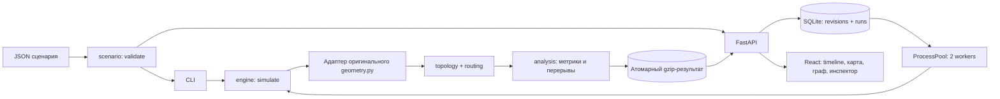

# Архитектура

Python/FastAPI выбран потому, что эталон уже написан на Python/NumPy: повторная реализация геометрии на другом языке создала бы лишнюю поверхность расхождений. React/TypeScript отвечает за взаимодействие и отображение. SVG/D3 позволяет управлять точными слоями полярной карты и устойчивой раскладкой графа без обязательного WebGL. SQLite и атомарные gzip-артефакты достаточны для одного демонстрационного сервера.

## Границы

| Модуль | Ответственность и ограничения |
|---|---|
| `scenario.py` | Парсинг, строгий структурный контракт, ссылки, неизменяемая копия, hash |
| `geometry_adapter.py` | Загрузка оригинала и SHA; единственный источник физических контактов |
| `topology.py` | Активные узлы, соседства, спутниковые компоненты, работающие gateways |
| `routing.py` | Детерминированный оптимальный путь и объясняющие факты; не знает HTTP/UI |
| `analysis.py` | Агрегирование дискретных рядов; не знает геометрию |
| `engine.py` | Полный pipeline, progress/cancel callbacks, внутренний результат и обязательный экспорт |
| `storage.py` | Владение данными, транзакции, переходы состояний, артефакты |
| `jobs.py` | Отдельные процессы для CPU, отмена и обработка ошибок |
| `api.py` | HTTP, cookie-сеанс, ограничения ресурсов, получение подробного snapshot |
| `App.tsx` | Координация загрузки, выбранного расчёта, истории и экрана |
| `NetworkView.tsx` | Серверные координаты → полярная карта / стабильный граф; фильтры рёбер |
| `Timeline.tsx` | Ряды состояния, события, дискретный курсор и навигация |

## Данные и жизненный цикл

Ревизия содержит полный валидированный сценарий и SHA. Расчёт ссылается на ревизию и владельца-сеанс; имеет UUID, статус, progress, времена и ошибку. Состояния: queued → running → completed; отмена проходит через cancelling → cancelled. При старте сервера незавершённые задания получают interrupted. Автоматического возобновления незавершённых расчётов нет; готовые результаты доступны после рестарта.

Задание пишет артефакт через временный файл и атомарное переименование. SQLite-транзакция завершения учитывает гонку с отменой. UI никогда не смешивает draft и результат другого run: результат всегда связан с `effective_scenario`. При смене run запросы отменяются; snapshots кешируются по паре run/index, максимум 120. Детальный snapshot пересчитывается по неизменяемому сценарию, а не хранится сотни раз вместе со всеми рёбрами.

Два расчётных процесса не блокируют основной HTTP event loop. Отмена проверяется каждый отсчёт, progress публикуется каждые 12. Никаких Celery/Redis/Kubernetes на текущем масштабе. При переходе к нескольким API-процессам потребуется отдельный планировщик и lease заданий: запускать текущую версию с одним API worker.

## HTTP

`GET /api/catalog`, `/api/scenario-schema`, `/api/health`; `POST /api/validate` и `/api/runs` принимают сырой JSON-сценарий. `/api/runs/{id}` — статус; `/result` — внутренний результат; `/snapshot/{index}` — подробное состояние; `/export` — результат организаторов; `/scenario` — фактический вход; `POST /cancel` — отмена. OpenAPI доступен в `/docs`.

Результаты принадлежат случайному 256-битному HttpOnly cookie-сеансу. Чужой ID даёт 404. SameSite=Strict, API не кешируется, в HTTPS включается Secure cookie. Это анонимный демонстрационный сервис; для многопользовательского production нужны аккаунты, политика хранения и общая квота по клиенту/IP.

Ограничения: не более 1024 спутников; оценка работы `T × (S² + S×G)` ≤ `ORBITA_MAX_WORK` (по умолчанию 100 млн); `T×G` ≤ 1 млн; до 3 незавершённых заданий на сеанс и 16 на сервер. Лимиты явно сообщаются пользователю и не обрезают расчёт. Они ограничивают объём, но не являются точной гарантией памяти или времени. Перед существенным повышением лимитов нужны нагрузочные измерения.

## Следующее расширение

Редактор и A/B должны использовать этот же run-контракт. Сравнение допустимо только с явной проверкой горизонта, шага, клиентов и прочих условий; разные сетки требуют общего пересчёта. N−1 и подбор параметров будут оркестрировать независимые вызовы ядра с собственным бюджетом. Ни рекомендации, ни 3D не должны содержать альтернативную геометрию.
