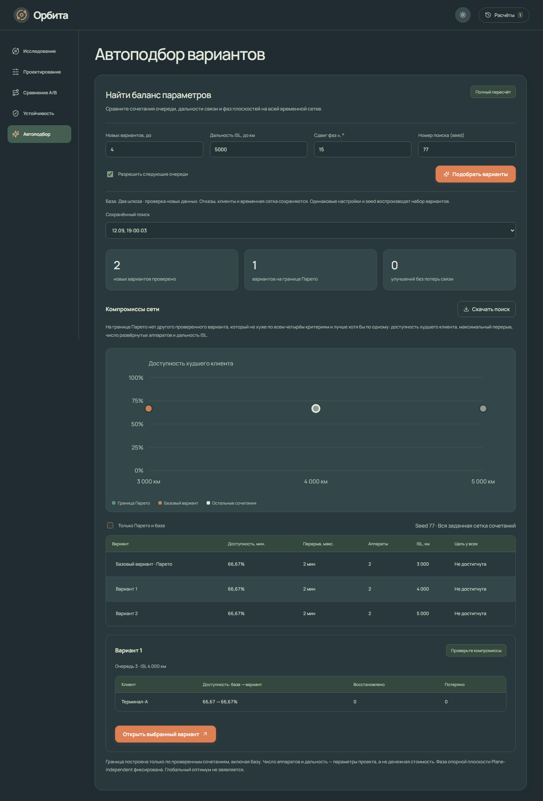

# Автоподбор вариантов

Режим «Автоподбор» добавляет ограниченный поиск сочетаний параметров. Он использует готовый базовый расчёт и обычный `simulate(...)` для каждого нового кандидата. Отказы, координаты клиентов, временная сетка, высота, наклонение, RAAN и состав аппаратов сохраняются.

## Запуск

1. Рассчитать сценарий в «Исследовании».
2. Открыть «Автоподбор». Задать до 24 новых вариантов, верхнюю дальность ISL, сдвиг фаз и номер поиска — seed. По умолчанию: 12 вариантов, seed 2026, сдвиг ±15°, дальность до исходной +2000 км, но не выше 10000 км.
3. При необходимости разрешить следующие очереди из уже заданного состава.
4. Нажать «Подобрать варианты». Можно отменить задание; незавершённый набор не выдаётся за итоговый.
5. Выбрать точку графика или строку таблицы, проверить изменения по каждому клиенту. «Открыть выбранный вариант» переносит проверенный сценарий в редактор. Оттуда его можно сохранить, пересчитать и сравнить в A/B.

Результат сохраняется вместе с настройками, seed, базой, метриками, сравнениями и контрольными суммами сценариев. «Скачать поиск» экспортирует весь набор, включая варианты вне границы Парето. Экспорт маршрутов производится обычным расчётом выбранного кандидата.

## Какие сочетания проверяются

- Очередь: исходная и разрешённые следующие очереди, которые добавляют хотя бы один аппарат.
- Дальность: исходная, середина между исходной и верхней, верхняя. Совпавшие значения объединяются.
- Фазы: 0, −сдвиг и +сдвиг относительно исходной фазы независимо для каждой задействованной плоскости, кроме опорной. Фазы приводятся к диапазону `[0,360)`.
- Опорная плоскость — первая по ID среди плоскостей с аппаратами, которые могут быть развёрнуты в этом поиске. Её фаза фиксирована. При нулевом сдвиге фазы не меняются.

Сочетания индексируются в смешанной системе счисления; нулевой индекс соответствует базе. Если бюджет покрывает всю сетку, проверяются все новые сочетания. Иначе `random.Random(seed)` выбирает уникальные ненулевые индексы; перед расчётом они сортируются. Политика зафиксирована как `seeded-grid-pareto-v1`, runtime Python 3.12. Название и порядок исходных ID не подменяются специальными контрольными значениями.

База используется повторно; для новых вариантов запускается полный расчёт на той же сетке. При изменении настроек создаётся новое задание. Если новых сочетаний нет либо превышен ресурсный бюджет, сервер отклоняет запрос до постановки в очередь. Ограничения: до 24 кандидатов, общий вычислительный бюджет `ORBITA_MAX_EXPERIMENT_WORK` и максимум 250000 комбинаций кандидат × отсчёт × клиент.

## Что такое граница Парето

Для каждого варианта используются четыре критерия:

| Критерий | Предпочтительное направление |
|---|---|
| Число достижимых отсчётов у худшего клиента | Больше |
| Максимальный перерыв среди всех клиентов | Меньше |
| Число развёрнутых аппаратов | Меньше |
| Требуемая дальность ISL | Меньше |

На одинаковой сетке число достижимых отсчётов эквивалентно доступности; целые числа позволяют не вводить погрешность сравнения процентов. Развёрнутые аппараты считаются по очереди, включая отказавшие: отказ не уменьшает размер проекта.

A доминирует B, если A не хуже по всем четырём критериям и строго лучше хотя бы по одному. Граница Парето содержит все недоминируемые варианты среди проверенных кандидатов **и базы**. Совпадающие показатели не устраняются как доминируемые. Более высокая доступность ценой большего состава может быть допустимым компромиссом.

График показывает только две проекции: дальность и доступность худшего клиента. На телефоне масштаб интерфейса перестраивается, чтобы подписи оставались читаемыми. Точки могут совпадать по двум координатам; таблица позволяет выбрать каждый вариант и увидеть остальные критерии. Граница не соединяется линией, которая могла бы ошибочно обозначать допустимые непроверенные промежуточные параметры.

«Улучшение без потерь» — отдельная проверка: восстановлен хотя бы один отсчёт и ни один клиент не потерял ни одного ранее доступного отсчёта. Парето не гарантирует это свойство и не гарантирует достижения цели. В подробностях всегда показаны выигрыши и потери каждого клиента.

Число аппаратов и дальность не являются оценкой стоимости. Поиск не доказывает глобальный оптимум за пределами проверенного набора и не оценивает радиобюджет оборудования.

## Реализация и воспроизведение

`orbita/optimization.py` содержит строгие настройки, генератор сетки, полный пересчёт и сравнение Парето. `POST /api/experiments` принимает `kind: "optimization"` и объект `options`. Задания используют общий пул процессов, отмену, изоляцию сеансов и атомарные артефакты. Миграция SQLite v3 добавляет `runs.options` без удаления существующих записей.

`web/src/OptimizationView.tsx` отвечает за форму, историю, график, таблицы и выбор кандидата. Цветовая тема хранится только в локальных настройках браузера и не влияет на расчёт. Геометрия, контакты и маршруты определяются сервером.

Проверки: `tests/test_optimization.py`, `web/tests/stage6.spec.ts`, `tests/verify_stage6_deployment.py`. Последний использует сохранённые контрольные расчёты из `tests/verify_deployment.py`, запускает шесть сочетаний на всех 720 отсчётах первой очереди и сохраняет измерение в `docs/stage6-measurements.json`. С ключом `--resume` проверяет отчёт и ревизию после перезапуска контейнера.
